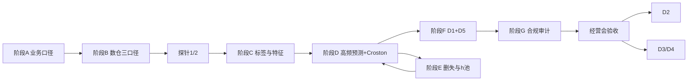

# 从 Java 到《原华规则逻辑框架》的技能地图与学习计划

> 对照文档：`原华规则逻辑框架.docx`（Part I · 需求落地规格书）  
> 读者画像：有 Java 工程经验，数仓 / 预测 / 库存优化 / 合规决策引擎几乎从 0 开始。  
> 用法：按阶段顺序学；每阶段有「对照规格」「必须掌握」「练习项目」「出门标准」。没达到出门标准不要跳到下一阶段硬啃高级模型。  
>
> **不参加数仓、只做 AI、且被 Agent 教程劝退的人：** 先读 [AI上手-不参加数仓.md](./AI上手-不参加数仓.md)，并跑 [`ai-starter/toy_forecast_d1.py`](../ai-starter/toy_forecast_d1.py)。原华的 AI 主线是预测 + D1/D5，不是 LangChain。

---

## 0. 先看清：你要建的不是一个 CRUD 系统

这份规格书描述的是一套 **医疗器械/耗材经销经营决策系统**，由五块拼起来：

| 模块 | 规格位置 | 一句话 |
|---|---|---|
| 数据底座 | §1、§2、G1–G4 | 客户/SKU/批次/三口径出货/回款/流向，先对齐再分析 |
| 预测引擎 | §3 | 状态空间模型：潜在需求 + 供给删失 + 压货透支池 `h_t`，输出 P10/P50/P90 |
| 决策规则 | §4 D1–D5 | 备货、冲任务、授信、投放、滞销退场 |
| 合规约束 | §5、G6–G7 | 硬红线生成期裁剪且不记收益；软边界效用衰减 + 人决策 + 审计 |
| 串联治理 | §6 | T+0 预测、T+1 建议、T+7 签收回填、MVP 先跑通一条产品线 |

Java 能覆盖其中很大一块 **工程骨架**（服务、规则、审计、类型安全、对接 ERP）。  
你缺的不是「再学一个框架」，而是三门新主科：

1. **分析型数据工程**（口径、血缘、批次效期、特征表）
2. **带约束的需求预测**（删失、间歇需求、分位数，而不是普通回归）
3. **库存与决策优化**（安全库存、s,S、净收益、合规可行集）

---

## 1. Java 背景：什么能直接用，什么必须新学

### 1.1 直接迁移（不要推倒重来）

| 你已有的 | 在本项目中的用法 | 对照 |
|---|---|---|
| Java 类型系统 / 封装 | 硬红线排除记录 **根本没有 benefit 字段**（规格 §5 物理保证） | G6、§5 |
| Spring 服务、权限、工作流 | 建议审批、规则变更双签、复核、对接 ERP | §4.6、§6.1–6.2 |
| 单元测试 / 契约测试 | 规则引擎、合规裁剪、审计字段断言 | §5.4、§6.3 |
| SQL + JDBC/MyBatis | 明细查询、部分 ETL、决策读模型 | §1 |
| JSON 配置、版本号 | `cfg_decision_rule` / `cfg_compliance_rule` | §4.1、§5.1 |
| 日志、幂等、trace | `log_audit_trail`（input_snapshot_hash、chosen_by） | §5.4 |

**结论：决策服务、合规引擎、审计台账、主数据 API，继续用 Java 做，这是你的主场。**

### 1.2 必须新学（按优先级）

| 优先级 | 技能 | 为什么绕不开 |
|---|---|---|
| P0 | 进阶 SQL + 维度建模（dim/dwd/dws） | 没有对齐的 `qty_sign` 和批次库存，后面全是空转 |
| P0 | 业务口径：三口径、压货、纯销、返利、集采 | G1–G4；不懂口径会把虚开/压货当成真实需求 |
| P0 | 库存基础：覆盖天数、安全库存、MOQ、效期截顶 | D1/D5 的公式本身 |
| P1 | Python 数据分析（pandas / 可视化） | 探针、特征、模型实验；规格点名 PyTorch 路径 |
| P1 | 时间序列入门 + 分位数预测 | §3 输出不是一个点，是 P10/P50/P90 |
| P1 | 规则引擎设计（配置化，禁热改阈值） | §4、§6.2 |
| P2 | 删失/截断统计、Croston 间歇需求 | G3、§3.3、§3.6 |
| P2 | 线性/约束优化入门 | D2 净收益、D4 预算分配、§5.3 效用 |
| P3 | XGBoost + 生存分析 | D3，MVP **明确后置** |
| P3 | Uplift / 因果入门 | D4，MVP **明确后置** |
| P4 | 粒子滤波、PMCMC/SMC² | §3.5 路径 A，A 类精修，**不要作为入门课** |

### 1.3 明确先不要学的（省半年弯路）

- 一上来深度学习「预测销量」、不上分位数、不管缺货删失  
- 一上来 Kafka/Flink 实时数仓（规格是 T+0 批处理 + T+7 校准）  
- 一上来微服务拆十几个仓库  
- 一上来 PMCMC / 粒子滤波（路径 A）；规格自己把路径 B（EM / PyTorch 近似）当作主实现  
- 一上来从零写前端大屏；MVP 用现成 BI（Superset / Metabase / 简易后台）即可  

---

## 2. 推荐技术栈（为 Java 背景定制，而不是追新）

```
经营数据 ──► 数仓(PostgreSQL/StarRocks 皆可)
                │  SQL + dbt 或 Java ETL
                ▼
         dws_fact_aligned / feat_*
                │
     ┌──────────┼──────────┐
     ▼          ▼          ▼
 Python 模型   Java 决策   合规引擎(Java)
 §3 预测      D1–D5       硬红线裁剪
 写 dws_demand_forecast    无 benefit 字段
     │          │          │
     └──────────┼──────────┘
                ▼
        dws_decision_advice + log_audit_trail
                ▼
        看板 / 审批 / ERP
```

| 层 | 建议 | 理由 |
|---|---|---|
| 仓库与 SQL | PostgreSQL 先足够；表按 §1 命名 | 你要练的是口径和窗口函数，不是集群运维 |
| 变换 | 先 SQL/dbt；复杂回填再用 Java | 血缘清晰，和规格 2.1 一致 |
| 预测 | Python 3 + pandas + statsmodels + 后期 PyTorch | 与 §3.5 路径 B 对齐 |
| 决策/合规 | Java 17+ / Spring Boot | 类型系统兑现 G6 |
| 调度 | 先 cron / Spring Scheduler；稳定后再 Airflow | 对齐 §6.1 的 T+0/T+1/T+7 |
| 看板 | Metabase 或简单管理端 | 经营会能拿出同一套数字即可（§6.5） |

语言分工口诀：**Java 管「能不能做、为何做、谁批的」；Python 管「需求大概是多少」。**

---

## 3. 学习原则（贯穿全程）

1. **规格驱动，而不是课程驱动。** 每学一个概念，立刻映射到 G1–G7 或 D1–D5 的一个字段/公式。  
2. **先探针后模型。** 规格 6.4：开工第一周先标压货月、核实 10 个客户纯销。你的第一个「模型」是人工标签和 SQL，不是滤波器。  
3. **先路径 B 后路径 A。** 批量近似能验收，再考虑粒子滤波。  
4. **口径不统一也能开工。** 用状态机 `order → ship → sign → return` 和 gap 预警，倒逼业务（§2.2、§6.2）。  
5. **硬红线从第一天就类型化。** 不要等「模型准了再加合规」。  
6. **边学边做 MVP。** 规格 6.5：1 条产品线 + A 类高频 + D5 + D1 基础备货（不含 D2）+ 探针。学习计划的主线就是把这个 MVP 做成。

---

## 4. 分阶段学习计划

说明：下面的「投入」是 **净学习+动手小时**，不是自然日。按每天 2 小时有效学习估算节奏即可。没写死「几个月做完」，因为进度取决于你是否能拿到真实出库/库存/效期数据。

---

### 阶段 A · 读懂规格与医疗流通业务（对照 §0、§1、G1–G7）

**目标：** 能把规格用自己的话讲给供应链/财务听，并指出哪些字段现在没有。

**必须掌握**

- 经销场景：进销存、票面 vs 净额、票折/后补、阶梯返利、任务量、季末压货  
- 医疗流通：终端 vs 经销商、进院、集采 `vbp_flag`、医保拨付延迟、CSO  
- 三口径：`qty_invoice / qty_ship / qty_sign`，**分析锚在签收**，T+7 校准（G1）  
- 数量 vs 金额：预测/库存/周转只读数量；金额只进返利与财务（G2）  
- 右删失：库存不够或 backorder 时，出货 **小于** 真实需求（G3）  
- 透支存量池 `h`：提前压下去、尚未被终端消耗的量（G4）  
- 合规二分：硬红线 vs 软边界（G6）

**对照规格要能回答**

- 为什么不能把开票量直接当需求？  
- `gap1 = qty_ship − qty_sign`、`gap2 = qty_invoice − qty_ship` 分别可能意味着什么？  
- `available_qty = on_hand + in_transit − allocated` 为什么必须按 **批次** 算？

**练习**

1. 用一张纸画出：厂商 → 你仓 → 经销商/医院 → 签收 → 回款。在图上标三口径三个时间戳。  
2. 把 §1 每张表抄成「我们现有系统有/没有/能间接算」清单。  
3. 写 10 条业务规则 FAQ（给未来的自己和业务方）。

**出门标准**

- 能独立解释 G1–G7，不看文档不卡壳。  
- 能指出 MVP **不需要** 的表（例如 D3 全量授信特征、D4 投放特征可后置）。

**推荐材料（概念，不绑死某一门课）**

- 公司内部：进销存、返利政策、近一年压货通知  
- 公开：药品/器械「流向」「纯销」「集采」基本概念；Kimball 维度建模第一章（事实/维度）

---

### 阶段 B · 分析型 SQL 与数仓分层（对照 §1、§2、§6.1）

**目标：** 独立建成 `dim_*` / `dwd_*` / 一张 `dws_fact_aligned`，跑通 T+0 对齐和 T+7 签收回填。

**必须掌握**

- 主键/外键、缓慢变化（客户 `tier`、SKU 的 abc/xyz **动态重算**）  
- 窗口函数：`LAG/LEAD`、滚动 30 天、滚动 60 天转换率  
- `COALESCE` 锚口径：`qty_anchor = COALESCE(qty_sign, qty_ship*sign_conv_rate, qty_invoice*inv_conv_rate)`  
- 派生字段：`fill_rate`、`backorder_proxy`、`push_intensity`、`inv_cover_days`、`near_exp_ratio`（§2.3）  
- 数据质量：效期缺失、签收滞后分布、三口径 gap 异常  

**Java 同学易错点**

- 把数仓当 OLTP：不要每条出库都 `UPDATE` 一张宽表当唯一真相。  
- 用 Java 循环代替窗口函数。能 SQL 解决的对齐/回填，先 SQL。

**练习项目 B1（必做）**

用一份脱敏或模拟数据（哪怕 Excel 导入 Postgres）：

1. 建 §1 的核心表：`dim_product`、`dim_customer`、`dwd_shipment`、`dwd_inventory_batch`、`dwd_purchase`。  
2. 写 ETL：计算 `age_days`、`available_qty`、`qty_anchor`、`sign_lag_days`。  
3. 做一张 gap 监控：按月 `gap1/gap2`，超过近 60 天均值 + 2σ 告警。  
4. 模拟 T+7：先用 ship 估 sign，7 天后用真实 sign 覆盖并记录及时率。

**出门标准**

- 任意 SKU+月，能回答：锚需求、在库、近效期占比、是否疑似压货。  
- 规格 6.3 数据层指标你能算出：gap、签收回填及时率、批次效期完整率。

**推荐材料**

- 窗口函数专题（任意 SQL 教材到「分析函数」即可）  
- 《数据仓库工具箱》事实表/维度表章节  
- dbt 官方 tutorial（可选，但有利于血缘）

---

### 阶段 C · Python 数据分析（为 §3、探针服务）

**目标：** 用 Python 读仓库数据、做探针 1/2、输出特征表 `feat_*` 的雏形。  
不是「转行算法」，是给 Java 工程师补 **实验与建模的工作台**。

**必须掌握**

- pandas：`groupby`、时间索引、缺失值、`merge`  
- 可视化：一条 SKU 的出货 vs 库存 vs 近效期  
- 基础统计：中位数、MAD、分位数、CV  
- 与数据库互操作：`sqlalchemy` / 读 SQL 出 DataFrame，再写回 `dws_*`

**对照规格**

- 探针 1：标 `is_push_month`、配对「透支月 → 回补月」（§6.4）  
- 探针 2：10 个客户纯销 vs 系统出货，看偏差（注意规格说了不要外推长尾）  
- `demand_pattern`：用 CV 与 ADI 每月打标 high_freq / intermittent（§3.6）  
- `push_intensity = purchase_qty / 鲁棒中位数(过去6月, 剔除压货月)`（§2.3）

**练习项目 C1（必做）**

1. 对每个 SKU 算 ADI、CV，画出分布，人工抽查分类是否合理。  
2. 实现探针 1 标签写入 `dwd_purchase.is_push_month`。  
3. 用「去扭曲中位数」当基线预测，算 WAPE（这是 μ₀ 初始化，§3.5）。

**出门标准**

- 离开 IDE 也能讲：什么是 ADI、为什么间歇品不能直接上 §3 主模型。  
- 有一份可复现的 Jupyter/脚本：输入出货表，输出 pattern 标签 + 压货标签。

**推荐材料**

- 《Python for Data Analysis》（pandas 够用即可，不必全书）  
- 官方 pandas time series 一章  

---

### 阶段 D · 预测入门：从基线到分位数（对照 §3.1、§3.6、§3.7，先不碰粒子滤波）

**目标：** 对 **A 类高频 SKU** 产出 `p10/p50/p90`，WAPE 和覆盖率可验收。间歇品用 Croston，不硬套连续模型。

**学习顺序（严格按这个顺序）**

| 步 | 内容 | 对应规格 | 做到什么 |
|---|---|---|---|
| D-1 | 朴素/季节朴素、移动平均、季节性 m=12 | 状态里的 `s_t` | 理解「水平+季节」 |
| D-2 | 指数平滑 / Holt-Winters | `μ_t, τ_t, s_t` 的简化版 | 能手调、能回测 |
| D-3 | 回测规范：时间切分、WAPE、分位覆盖率 | §3.5 验收、§6.3 | 不会用随机切分骗自己 |
| D-4 | 分位数：经验分位、或简单分位回归 | G5、`dws_demand_forecast` | 输出 P10/50/90 而不是一个点 |
| D-5 | Croston / SBA | §3.6 间歇品 | 输出发生概率 × 条件均值 |
| D-6 | 衰退检测：vbp/替代 + 需求率单调降 | declining → D5 退场 | 规则 + 斜率，先不用深度学习 |

**练习项目 D1（必做，对齐 MVP）**

选 1 条产品线里 20–50 个高频 SKU：

1. Holt-Winters 或 `statsmodels` 的 UnobservedComponents（局部水平+季节）出 P50。  
2. 用残差标准差估 P10/P90（先简化：`P50 ± 1.28σ`，这与 D1 里 `σ_d = (P90−P50)/1.28` 正好对上）。  
3. 间歇 SKU 走 Croston-SBA，话术做成：「X% 概率要货、常备 n、有单再采」。  
4. 写入 `dws_demand_forecast` 字段：`p10/p50/p90/demand_pattern/model_version/fit_metric`。

**出门标准**

- 高频品：持有期覆盖率大致靠近名义值（不必完美）。  
- 间歇品：不再输出「每月 0.3 件」这种业务听不懂的点预测。  
- 你能向业务解释：缺货月的出货 **不能** 当真实需求来惩罚模型。

**推荐材料**

- Hyndman *Forecasting: Principles and Practice*（免费电子书）：时间序列、ETS、Croston、回测  
- statsmodels `UnobservedComponents` 文档（这是状态空间的工业入门，不是论文）

---

### 阶段 E · 删失、供给开关、透支池（对照 G3–G4、§3.2–§3.5 路径 B）

**目标：** 理解并实现规格路径 B 的 **思想**，而不是论文级推断。这是预测部分最关键的一步。

**必须掌握的数学（工程师深度即可）**

- 正态分布密度 φ、CDF Φ；「右删失」= 只知道需求 ≥ 出货  
- 截断正态的期望（用来回填伪观测）  
- `softplus` / `sigmoid`：把 max/开关变光滑，便于优化  
- 状态向量直觉：  
  - `μ` 水平、`τ` 趋势、`s` 季节、`h` 透支池  
  - `h_t` 因压货注入、因终端消耗释放  
  - 观测是 `d* − r`（潜在需求减去透支释放），再被库存上界截住  

**路径 B 落地步骤（与规格一致）**

1. 用 `backorder_proxy`、`available_qty`、`fill_rate` 给每条观测打上 §3.3 的三种情形：精确 / 供给删失 / 透支压制。  
2. 删失样本：不要用 `S_t` 当 `d*`；用截断期望或对似然降权。  
3. `c_t = sigmoid(k·(fill_t−0.9))·(1−b_t)` 做软开关（§3.4）。  
4. `push_intensity` → `inj_t`；`h_t` 用软plus 保证非负。  
5. 先 RTS/EM **或** 极简 PyTorch（水平+季节+h，负对数似然），收敛条件用规格的相对变化 / NLL。  
6. 验收：`h_t` 轨迹对探针 1 的时序 F1；删失比例与缺货月一致。

**练习项目 E1（必做）**

用 1 个「明显被压过货」的 SKU：

- 画出：采购量、出货、库存、你估计的 `h_t`。  
- 人工检查：压货月 `h` 上升，随后数月出货虚高而 `h` 下降。  
- 对比「忽略删失的 Holt-Winters」vs「删失加权」的 P50，看缺货月是否不再被当成需求消失。

**出门标准**

- 能在白板上画出 §3.2–3.3 的三条观测分支，并指出每条该用 `log φ` 还是 `log(1−Φ)`。  
- 代码里 **没有任何地方** 在 `available_qty=0` 时把出货当完整需求拟合。  
- **先不要** 实现 PMCMC/SMC²。那是路径 A，规格写给 A 类高价值精修。

**推荐材料**

- 任意「Tobit / censored regression」教程（理解删失即可）  
- Kalman / 状态空间直觉：先看「水平+趋势+季节」动画，再看公式  
- PyTorch 自动微分：只学 tensor、autograd、optimizer 三件套  

---

### 阶段 F · 库存理论与 D1/D5 规则（对照 §4.2、§4.5、MVP）

**目标：** 用预测输出算出补货建议和近效期清单，能上经营会。这是 MVP 的决策核。

**必须掌握**

- 服务水平 vs 满足率（fill_rate）；`z` 与分位数  
- 规格公式（要能手算一个 SKU）：  
  - `σ_d = (P90 − P50) / 1.28`  
  - `SS = z · σ_d · √lead_time`，近效期高则下调 SS  
  - `s = P50·LT + SS`  
  - `S_level = P50·(LT+review) + SS`  
  - `Q_raw = max(0, S_level − available − in_transit)`  
  - `Q_eff = min(Q_raw, 效期内可销完的量)` ← 效期硬截顶  
  - `Q_final = ceil(Q_policy / moq) * moq`  
- 覆盖天数 `inv_cover_days`、近效期红/黄、declining 停采  
- 例外：停产/物流卡 → 软开关，到货即补 + 替代源  

**练习项目 F1（MVP 决策，必做）**

Java 实现 `logic.D1` + `logic.D5`：

1. 读 `dws_demand_forecast` + `dwd_inventory_batch`。  
2. 输出 `dws_decision_advice` 四件套：`action, reason_chain, risk_band, compliance_tag...`（§4.6）。  
3. D5：近效期红、呆滞黄、退场候选 + 预计损失。  
4. 单测：MOQ 进位、效期截顶、P50=0、无批次效期时的降级策略。

**出门标准**

- 随机抽 5 个 SKU，供应链同事能顺着「理由链」复现数字。  
- 报废风险高的批次不会再给出「按常规 SS 加库存」的建议。

**推荐材料**

- 任意运筹/供应链教材的「再订货点、安全库存、(s,S)」三节  
- 效期与报废：按「剩余可销天数 vs 库存/月销」理解 §4.5 的红灯公式即可  

---

### 阶段 G · 配置化规则引擎、审计与合规类型系统（对照 §4.1、§5、§6.2）

**目标：** 把 D1/D5 从「写死 if-else」升级为可版本化配置；硬红线从架构上不能记下违规收益。

**必须掌握**

- 规则 schema：`scope / trigger / inputs / logic_ref / params / effective / version`  
- 变更流程：申请 → 合规/业务双签 → 灰度 → 全量 → 留痕；**禁热改阈值**  
- 硬红线：生成期 `reject_at_generation`；排除记录只有 `rule_id + reason`，没有 benefit  
- 软边界：`U = ΔGM · roi_coef · (1−λ·risk) − compliance_cost`；先验风险必须打标  
- 审计字段：`trace_id, input_snapshot_hash, excluded_hard, chosen_by, forced_high_risk, review_*`  
- Java 实现要点：`record HardExclusion(ruleId, reason)` **禁止** 带 `BigDecimal benefit`；用编译器而不是公约保证 G6  

**练习项目 G1（必做）**

1. `cfg_decision_rule`、`cfg_compliance_rule` 入表，启动时加载，变更走「新版本行」而非 update 原地改。  
2. 写 3 条硬红线检测（个人账户、无议程会议、超标接待），命中则候选直接丢掉。  
3. 单测断言：序列化后的审计 JSON **不含** 被拒方案的 ROI/毛利字段。  
4. 人工选中高风险软边界 → 强制复核工单。

**出门标准**

- 代码评审能证明：被硬红线裁掉的方案在内存对象、日志、API、数据库四处都没有收益数字。  
- 规则 version 可回放：给定 `input_snapshot_hash` 能复现当时建议。

**推荐材料**

- 你已有的 Java：record/sealed class、Jackson 反序列化白名单  
- 规则引擎：先自研 JSON+策略接口；规模大了再看 Drools，不要一上来上重量级 BRMS  

---

### 阶段 H · 优化与 D2 政策叠加（对照 §4.2 D2、§5.3）

**前置：** F、G 已稳定。规格 MVP **不含 D2**，本阶段是扩面。

**必须掌握**

- 净收益：增量返利 −（资金成本 + 仓储 + 效期报废期望 + 断货机会成本）  
- 临界点 `N*`：净收益 = 0 的额外压货量；只推荐 `N≤N*` 的冲量  
- 约束优化入门：决策变量、目标、不等式约束；先网格搜索 `N`，再上求解器  
- OR-Tools / PuLP 解「预算 B 下最大化 ΣU」这种规模  

**练习项目 H1**

对 1 个有任务量、有返利阶梯的品种：画出 `N → 净收益` 曲线，标 `N*`，接到 D1 的 `Q_policy`。

**出门标准**

- 任务进度不足时，系统能说出「不建议冲任务，临界点=N*」，而不是无脑补到任务量。

---

### 阶段 I · D3 授信与 D4 投放（对照 §4.3、§4.4，后置）

**前置：** 回款表质量可用；业务认可黑名单流程。规格把它们放在 MVP 退出、换预算之后。

**D3 技能**

- 类别不平衡的分类：逻辑回归 → XGBoost  
- 概率校准（不要直接把 0.8 当「80% 会坏账」而不校验）  
- 生存分析直觉：回款时间分布（Kaplan-Meier / Cox 即可）  
- 连续阈值：`thr = base · (1+κ·资金压力) · (1+ψ·医保紧张度)`，公立三甲医保延迟用 `insurance_tight_idx` 修正，避免误杀  

**D4 技能**

- 渗透缺口 `penetration_gap`  
- Uplift 与「边际回报」比普通倾向模型难，先做：同类渗透差 + 进院状态打折 + 按边际毛利/成本排序  
- 真因果/Uplift 放到有对照活动数据之后  

**出门标准（D3）**

- 有本月 +/- 名单、触发原因、建议额度、`p_default` 与阈值构成。  
- 误杀率被业务抽查过（尤其公立三甲）。

---

### 阶段 J · 产品化、漂移与路径 A（对照 §6、§3.5 路径 A）

**何时才需要**

- 经营会已经用同一套数字做决策（§6.5 退出标准）  
- 高频品路径 B 的覆盖率、`h_t` 的 F1 遇到天花板  
- 有专人（或你自己）能读状态空间/MCMC 文献  

**内容**

- 模型版本、特征漂移、规则评审月会  
- 粒子滤波 + 删失观测的截断正态重采样；PMCMC/SMC² 只针对 A 类高价值  
- ERP 回写、一键执行、灰度  

这条是 **研究/精修轨**，不是 0→1 主轨。

---

## 5. 与规格 MVP 对齐的「边学边做」主线

规格 6.5：6–8 周产品 MVP。那是 **有数据、有业务配合** 的实施节奏，不是你从零上课的节奏。  
建议把学习与实施锁成同一条链：



**MVP 范围（只做这些）**

- 1 产品线、A 类高频  
- 探针 1/2  
- `dws_demand_forecast` 的 P10/50/90（路径 B 简化版即可）  
- D5 全做、D1 基础备货  
- **不做** D2 优化、D3、D4、间歇品精修、政策沙盘、粒子滤波  

**MVP 退出标准（规格原文落地）**

用同一套数字开一次经营会，并避免一次可量化的压货或断货。用这个结果换预算，再学 H/I。

---

## 6. 每周学习结构（可重复模板）

对每个阶段用同一套循环，避免只看课不做：

| 时段 | 做什么 |
|---|---|
| 概念 | 对照规格一节，写半页笔记：符号 ↔ 字段 ↔ 业务含义 |
| 最小实验 | 1 个 SKU 或 1 条规则，跑通数字 |
| 工程化 | 表结构 / Java 接口 / 测试 / 版本号 |
| 验收 | 用 §6.3 对应层的指标量一次 |
| 回讲 | 讲给非技术人员：建议是什么、风险是什么、不执行代价是什么 |

Java 同学特别要逼自己 **先画字段再写类**：先有 `dwd_shipment.qty_sign`，再有 `ShipmentRecord`。

---

## 7. 能力检查清单（对照规格，可打印）

把「会」定义成能交代码或能算数，而不是「听过」。

**数据（§1–§2）**

- [ ] 三口径状态机能画出来，gap 能预警  
- [ ] `qty_anchor` 与 60 天转换率已实现  
- [ ] 批次 `available_qty`、库龄、近效期占比正确  
- [ ] `push_intensity`、`backorder_proxy`、`fill_rate` 有定义和单测  

**预测（§3）**

- [ ] 高频品 P10/50/90 有回测覆盖率  
- [ ] 间歇品走 Croston-SBA，话术可商务使用  
- [ ] 缺货/backorder 样本按删失处理  
- [ ] `h_t` 能对上探针 1 的压货-回补（哪怕先很糙）  
- [ ] declining 能转入 D5，不再按常规备货  

**决策（§4）**

- [ ] D1 手算与代码一致：SS、效期截顶、MOQ  
- [ ] D5 红黄退场清单 + 预计损失  
- [ ] 建议四件套字段齐全  
- [ ] D2/D3/D4 未做时，配置里显式关闭，而不是静默输出垃圾  

**合规（§5）**

- [ ] 硬红线生成期裁剪  
- [ ] 排除对象无 benefit 字段（类型系统）  
- [ ] 软边界衰减与人决策复核  
- [ ] 审计可回放，规则变更有双签痕迹  

---

## 8. 资源清单（少而够用）

按「先读什么」排，避免书单膨胀。

1. **规格本身反复读 §0、§2.2、§3.3、§4.2、§5、§6.5** — 这是需求，不是附录  
2. **SQL 窗口函数 + 维度建模** — 阶段 B  
3. **Hyndman FPP3** — 阶段 D  
4. **pandas 实务 + 一本入门统计（均值/分位/正态分布/似然）** — 阶段 C–E  
5. **安全库存与 (s,S)** — 阶段 F  
6. **Tobit/删失回归科普 + statsmodels 状态空间** — 阶段 E  
7. **Java 17 record/sealed + 你现有的 Spring 测试功底** — 阶段 G  
8. **OR-Tools 入门** — 阶段 H  
9. **《机器学习实战》级的逻辑回归/XGBoost + 生存分析科普** — 阶段 I  
10. **Durbin & Koopman 或粒子滤波教程** — 仅阶段 J、路径 A  

课程形态建议：每阶段 **短教程 + 你自己的 SKU 数据**，不要先买一个「一年机器学习训练营」。

---

## 9. 角色分工建议（即使现在只有你一个人）

规格里的系统，完整形态通常是 3 类角色。你可以从一个人逐步长出接口，避免技能树摊太薄：

| 角色 | 主技能 | 对应阶段 | 可后补 |
|---|---|---|---|
| 你（Java 工程） | 服务、规则、合规类型、审计、ERP | F、G、主数据 API | 一直是骨干 |
| 数据分析（可以是你兼职） | SQL、探针、特征、预测路径 B | B、C、D、E | 先兼职，A 类精修再考虑专人 |
| 业务 owner | 口径、压货标签、经营会、规则双签 | A、§6.2 | 没有此人，系统不会被用 |

一个人做 MVP 时的能力配比建议：**一半数仓与口径、三成 D1/D5 规则与合规、两成预测基线。**  
预测不是 0→1 的最大风险；**错误口径把压货当需求** 才是。

---

## 10. 常见岔路

| 岔路 | 规格里的正确做法 |
|---|---|
| 先统一全部口径再开工 | §2.2 / §6.2：状态机先跑，gap 当 KPI 倒逼 |
| 用金额做预测 | G2：预测只读数量 |
| 用开票量当需求 | G1：sign 为锚 |
| 缺货月当需求变差 | G3：右删失 |
| 任务没完成就加压货 | D2：先算净收益临界点 N* |
| 模型输出一个数给采购 | G5：P10/50/90；间歇品要概率×条件均值 |
| 合规事后看 ROI 再拦 | G6：生成期裁剪，不记收益 |
| 阈值在生产热改 | §6.2：双签+灰度+留痕 |

---

## 11. 下一步（学完阶段 A 当天就能做）

1. 列出 §1 表 vs 现有 ERP/Excel 的字段对照（有/无/能间接算）。  
2. 锁定 MVP 产品线与 20 个 A 类高频 SKU。  
3. 按 6.4 启动探针 1（压货月）和探针 2（10 客户纯销）。  
4. 建 Postgres 核心表，把阶段 B 的 `dws_fact_aligned` 跑起来。  
5. 预测先用「去扭曲中位数 + 季节因子」，并行学习阶段 D；不要等学完状态空间再出第一张补货建议。

---

## 附录 · 规格符号速查（学习时当生词表）

| 符号/字段 | 含义 | 首次出现 |
|---|---|---|
| `qty_sign` | 签收量，分析锚 | G1 |
| `h_t` | 透支存量池 | G4、§3.2 |
| `d_t*` | 潜在终端需求 | §3.1 |
| `b_t` | 缺货/欠交代理变量 | §3.1 |
| `p_t` | 压货强度 | §3.1 |
| `c_t` | 供给健康软开关 | §3.4 |
| `P10/P50/P90` | 需求分位数 | G5 |
| `ADI/CV` | 间歇/波动分类 | §3.6 |
| `N*` | 冲任务净收益为零的额外量 | §4.2 |
| `U(o)` | 软边界下的效用 | §5.3 |

读公式时保持一个习惯：**每个符号在 §1 里都应该能落到一张表的一个字段（或派生字段）。落不到，就还没学会。**
