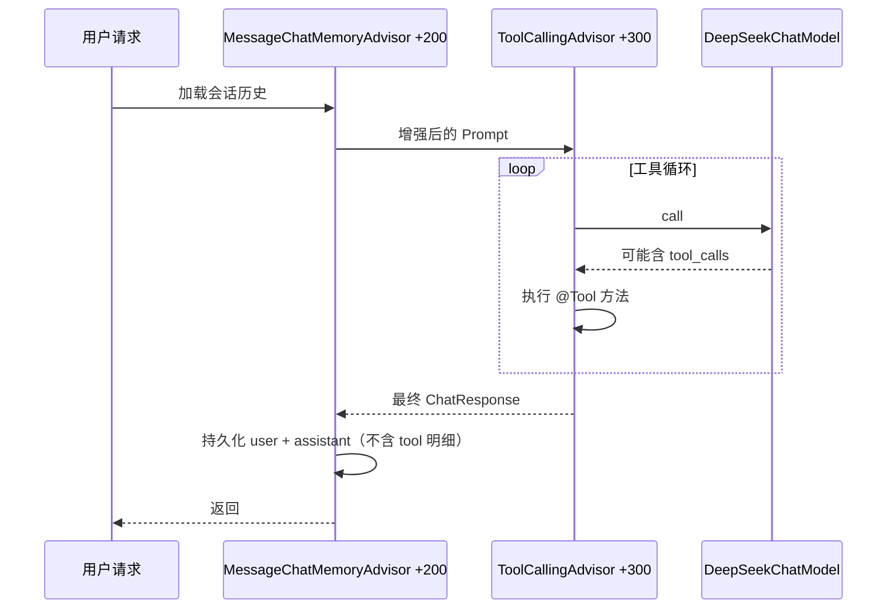

# 06 · Advisor 机制详解

> **本节目标：** 理解 Advisor 链、默认注册的 `ToolCallingAdvisor`、记忆 Advisor 的 order 与 `CONVERSATION_ID` 必传规则。  
> **预计用时：** 2 小时。

---

## 1. Advisor 是什么

把 Advisor 想成 **Servlet Filter 链** 或 **Spring MVC HandlerInterceptor**：

```
请求进入 ChatClient
    → Advisor₁ before（改 prompt / 加历史 / 检索文档）
    → Advisor₂ ...
    → 调用 ChatModel
    → Advisor₂ after
    → Advisor₁ after
    → 返回 ChatClientResponse
```

每个 Advisor 可以：

- 在模型调用**前**修改 `ChatClientRequest`（尤其是 `Prompt`）；
- 在模型调用**后**处理 `ChatResponse`；
- 与 `ToolCallingAdvisor` 配合时，可能参与**多轮循环**（工具调用）。

**2.0 的核心架构变化：** 工具循环在 Advisor 链里，不在 `ChatModel` 内部。

---

## 2. 链的顺序为什么重要

Advisor 按 **order 值** 排序执行。order 越小，越靠外（越早参与「整次用户请求」）。

与工具循环相关的两个默认 order（请记住）：

| Advisor | 默认 order | 位置含义 |
|---|---|---|
| `MessageChatMemoryAdvisor` | `HIGHEST_PRECEDENCE + 200` | **循环外**（默认） |
| `ToolCallingAdvisor`（自动注册） | `HIGHEST_PRECEDENCE + 300` | 工具循环核心 |

```
【循环外】MessageChatMemoryAdvisor (+200)
    加载历史一次 → 只持久化最终 user/assistant
        ↓
【工具循环内】ToolCallingAdvisor (+300)
    模型 ↔ 工具 可能多轮
        ↓
【循环外】其它后置 Advisor（日志、校验等）
```

若把记忆 Advisor 调到 `+400`（大于 300），它会进入循环**内**，能看见每轮 tool 消息——但多数 `ChatMemoryRepository` 存不下 tool 消息，**生产默认用 +200 放循环外**。

---

## 3. ToolCallingAdvisor 自动注册

只要没关掉，**每次** `ChatClient` 调用都会自动挂上 `ToolCallingAdvisor`，即使你本次没配静态工具——因为别的 Advisor 可能在运行时动态注入工具。

```java
String answer = chatClient.prompt()
        .user("明天星期几？")
        .tools(new DateTimeTools())   // 2.0 用 .tools()，禁止 .toolNames()
        .call()
        .content();
```

全局关闭自动注册（一般不推荐学习期关）：

```yaml
spring:
  ai:
    chat:
      client:
        tool-calling:
          enabled: false
          advisor-order: 300   # 默认 HIGHEST_PRECEDENCE + 300
```

单次关闭：

```java
import org.springframework.ai.chat.client.advisor.AdvisorParams;

chatClient.prompt("...")
        .tools(new DateTimeTools())
        .advisors(AdvisorParams.toolCallingAdvisorAutoRegister(false))
        .call()
        .content();
```

【禁止】`internalToolExecutionEnabled` —— 1.x ChatModel 内部执行工具，2.0 已弃用。

---

## 4. 配置 Advisor：defaultAdvisors 与 advisors

### 4.1 Builder 级默认

```java
package com.example.agent.config;

import org.springframework.ai.chat.client.ChatClient;
import org.springframework.ai.chat.client.advisor.SimpleLoggerAdvisor;
import org.springframework.ai.chat.memory.ChatMemory;
import org.springframework.ai.chat.memory.MessageWindowChatMemory;
import org.springframework.ai.chat.client.advisor.MessageChatMemoryAdvisor;
import org.springframework.context.annotation.Bean;
import org.springframework.context.annotation.Configuration;

@Configuration
public class AdvisorConfig {

    @Bean
    ChatMemory chatMemory() {
        return MessageWindowChatMemory.builder().maxMessages(20).build();
    }

    @Bean
    ChatClient advisedChatClient(ChatClient.Builder builder, ChatMemory chatMemory) {
        return builder
                .defaultAdvisors(
                        MessageChatMemoryAdvisor.builder(chatMemory).build(),
                        new SimpleLoggerAdvisor()   // 调试日志，生产慎用或降级
                )
                .build();
    }
}
```

### 4.2 每次调用追加参数（2.0 记忆必做）

```java
import org.springframework.ai.chat.memory.ChatMemory;

String reply = advisedChatClient.prompt()
        .advisors(a -> a.param(ChatMemory.CONVERSATION_ID, sessionId))
        .user("继续刚才的话题")
        .call()
        .content();
```

| 规则 | 说明 |
|---|---|
| `ChatMemory.CONVERSATION_ID` **每次必传** | 不传抛 `IllegalArgumentException` |
| 构造时 `.conversationId(...)` | **2.0 已移除**，禁止用 |
| 多租户 | sessionId 建议含 `tenantId:userId:session` |

```java
String conversationId = tenantId + ":" + userId + ":" + sessionUuid;

chatClient.prompt()
        .advisors(a -> a.param(ChatMemory.CONVERSATION_ID, conversationId))
        .user(question)
        .call()
        .content();
```

---

## 5. MessageChatMemoryAdvisor 完整示例

```java
package com.example.agent.web;

import com.example.agent.prompt.DecisionSystemPrompt;
import org.springframework.ai.chat.client.ChatClient;
import org.springframework.ai.chat.memory.ChatMemory;
import org.springframework.web.bind.annotation.PostMapping;
import org.springframework.web.bind.annotation.RequestBody;
import org.springframework.web.bind.annotation.RestController;

@RestController
public class MemoryChatController {

    private final ChatClient chatClient;

    public MemoryChatController(ChatClient chatClient) {
        this.chatClient = chatClient;
    }

    public record MemoryChatRequest(
            String conversationId,
            String tenant,
            String role,
            String dataAsOf,
            String message
    ) {}

    @PostMapping("/api/chat/memory")
    public String chatWithMemory(@RequestBody MemoryChatRequest req) {
        return chatClient.prompt()
                .system(s -> s.text(DecisionSystemPrompt.TEXT)
                        .param("tenantName", req.tenant())
                        .param("userRole", req.role())
                        .param("dataAsOf", req.dataAsOf()))
                .advisors(a -> a.param(ChatMemory.CONVERSATION_ID, req.conversationId()))
                .user(req.message())
                .call()
                .content();
    }
}
```

第二轮用**同一个** `conversationId`，模型能看见上一轮问答（默认窗口 20 条）。

---

## 6. AdvisorSpec API

```java
chatClient.prompt()
        .advisors(a -> a
                .param("customKey", "customValue")
                .params(Map.of("k1", "v1", "k2", "v2"))
                .advisors(anotherAdvisor))
        .user("...")
        .call()
        .content();
```

`AdvisorSpec` 方法：

- `param(String k, Object v)`
- `params(Map<String, Object> p)`
- `advisors(Advisor... advisors)`
- `advisors(List<Advisor> advisors)`

---

## 7. SimpleLoggerAdvisor（调试）

```yaml
logging:
  level:
    org.springframework.ai.chat.client.advisor: DEBUG
```

```java
ChatResponse response = chatClient.prompt()
        .advisors(new SimpleLoggerAdvisor())
        .user("Tell me a joke")
        .call()
        .chatResponse();
```

生产环境注意脱敏；优先用 Micrometer 观测（part-07 展开）。

---

## 8. RAG 与 QuestionAnswerAdvisor

2.0 **主推**模块化 RAG：`RetrievalAugmentationAdvisor`（`spring-ai-rag` 模块），在 **part-05** 详讲。

本章只建立直觉：**Advisor 可插拔**，检索、记忆、工具、结构化校验都可以做成 Advisor 排序组合。

【不要】把 `QuestionAnswerAdvisor` 当 2.0 主线教程默认方案——那是 1.x 时代大量示例的路径，新项目用模块化 RAG。

---

## 9. 自定义 Advisor 骨架（了解即可，part-04 会加深）

```java
package com.example.agent.advisor;

import org.springframework.ai.chat.client.ChatClientRequest;
import org.springframework.ai.chat.client.ChatClientResponse;
import org.springframework.ai.chat.client.advisor.api.CallAdvisor;
import org.springframework.ai.chat.client.advisor.api.CallAdvisorChain;
import org.springframework.core.Ordered;

public class TenantGuardAdvisor implements CallAdvisor {

    @Override
    public String getName() {
        return "TenantGuardAdvisor";
    }

    @Override
    public int getOrder() {
        return Ordered.HIGHEST_PRECEDENCE + 100;  // 比记忆还外层
    }

    @Override
    public ChatClientResponse adviseCall(ChatClientRequest request, CallAdvisorChain chain) {
        // 示例：从 context 取租户并校验（真实逻辑接你的权限服务）
        String tenant = (String) request.context().get("tenantId");
        if (tenant == null || tenant.isBlank()) {
            throw new IllegalArgumentException("缺少 tenantId");
        }
        return chain.nextCall(request);
    }
}
```

注册：

```java
@Bean
ChatClient guardedClient(ChatClient.Builder builder) {
    return builder.defaultAdvisors(new TenantGuardAdvisor()).build();
}
```

---

## 10. 工具循环配置属性速查

| 属性 | 默认 | 说明 |
|---|---|---|
| `spring.ai.chat.client.tool-calling.enabled` | true | 是否自动注册 ToolCallingAdvisor |
| `spring.ai.chat.client.tool-calling.advisor-order` | HIGHEST_PRECEDENCE + 300 | 链中位置 |

自定义 `ToolCallingAdvisor.Builder` Bean 可覆盖默认 Manager（part-04）。

---

## 11. 架构示意（请手绘一遍）



---

## 12. 本节小结

1. Advisor 链是 2.0 编排核心；顺序由 order 决定。
2. `ToolCallingAdvisor` 默认自动注册，order ≈ +300。
3. `MessageChatMemoryAdvisor` 默认 +200，在循环外；记忆 ID 必须每次 `.param(ChatMemory.CONVERSATION_ID, id)`。
4. RAG 下章讲；本章知道 Advisor 可插即可。
5. 禁止 1.x 的 `PromptChatMemoryAdvisor`、`toolNames`、`internalToolExecutionEnabled`。

下一篇：`07-多ChatClient与快慢模型.md`。
